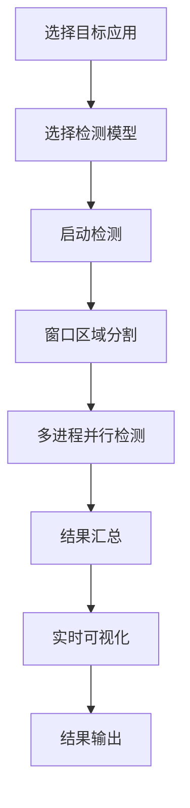

# 🎯 App 多区域 YOLO 实时检测系统

## 📖 项目概述

这是一个基于 YOLO 的实时目标检测系统，专门设计用于监控和检测指定应用程序窗口中的目标对象。系统采用多区域并行检测技术，能够高效地对任意应用程序窗口进行实时目标检测，并提供直观的可视化界面。

### 🌟 核心特性

- **🖥️ 应用程序窗口监控**：可以监控任意应用程序窗口，如浏览器、游戏、视频播放器等
- **⚡ 多区域并行检测**：将目标窗口分割为4个区域，使用多进程并行检测，提升检测效率
- **🎨 实时可视化**：实时显示检测结果，包括检测框、置信度和类别信息
- **🤖 多模型支持**：支持多种 YOLO 模型格式（.pt, .pth, .onnx, .engine）
- **🔧 丰富的工具集**：包含数据增强、格式转换、训练等完整工具链
- **📊 性能监控**：实时显示 FPS 和检测统计信息

## 🏗️ 项目架构

```
📦 项目根目录
├── 🎮 gui/                    # 图形用户界面
│   ├── main_gui.py           # 主界面程序
│   ├── __init__.py
│   └── yolov8n.pt           # GUI专用模型
├── 🔍 detection/             # 检测核心模块
│   ├── detector.py          # 检测器实现
│   └── __init__py.py
├── 🛠️ utils/                 # 工具函数
│   ├── app_window_utils.py  # 窗口操作工具
│   └── __init__.py
├── 🧰 tools/                 # 辅助工具集
│   ├── 🖼️ 图像增强工具
│   ├── 📊 数据处理工具
│   ├── 🚀 训练工具
│   └── 📝 格式转换工具
├── 📁 datasets/              # 数据集
│   ├── images/              # 图像数据
│   ├── labels/              # 标签数据
│   └── data.yaml           # 数据集配置
├── 🤖 models/                # 模型文件
├── 🎓 train/                 # 训练相关
├── ⚙️ config.py              # 配置文件
├── 🚀 main.py                # 程序入口
└── 📋 requirements.txt       # 依赖列表
```

## 🚀 快速开始

### 环境要求

- **Python**: 3.8+
- **操作系统**: Windows (主要支持)
- **GPU**: 可选，支持 CUDA 加速

### 安装步骤

1. **克隆项目**
```bash
git clone <项目地址>
cd <项目目录>
```

2. **创建虚拟环境**
```bash
python -m venv .venv
.venv\Scripts\activate  # Windows
```

3. **安装依赖**
```bash
pip install -r requirements.txt
```

4. **启动程序**
```bash
python main.py
```

## 🎮 使用指南

### 主界面功能

#### 1. 📱 应用程序选择
- **输入关键字**：在输入框中输入要监控的应用程序窗口标题关键字
- **列出可见应用**：点击按钮查看当前所有可见的应用程序窗口
- **自动匹配**：系统会自动查找匹配的窗口

#### 2. 🤖 模型管理
- **模型选择**：支持从本地文件夹选择模型
- **格式支持**：.pt, .pth, .onnx, .engine
- **模型信息**：显示模型文件大小和状态
- **快速切换**：从列表中快速选择预设模型

#### 3. ⚡ 检测控制
- **开始检测**：启动多区域并行检测
- **停止检测**：安全停止所有检测进程
- **实时显示**：在 Canvas 中实时显示检测结果

#### 4. 📊 结果展示
- **可视化界面**：实时显示检测画面和检测框
- **结果日志**：详细的检测结果文本输出
- **性能信息**：FPS 和检测统计

### 核心工作流程



## 🔧 核心技术

### 多区域并行检测

系统将目标窗口分割为 4 个区域：
- **左上区域** (Region 0)
- **右上区域** (Region 1) 
- **左下区域** (Region 2)
- **右下区域** (Region 3)

每个区域由独立的进程处理，实现真正的并行检测。

### 屏幕截图技术

使用 MSS (Multiple Screen Shot) 库实现高效的屏幕截图：
- **系统级截图**：直接从显存读取像素数据
- **区域截图**：只截取指定窗口区域
- **实时性能**：优化的内存管理和图像处理

### 检测算法

基于 Ultralytics YOLO 框架：
- **模型支持**：YOLOv8/v9/v10 等最新版本
- **多格式兼容**：PyTorch, ONNX, TensorRT
- **GPU 加速**：自动检测和使用 CUDA

## 🧰 工具集介绍

### 📸 图像增强工具

位于 `tools/` 目录，提供完整的数据增强解决方案：

#### 基础增强功能
- **几何变换**：翻转、旋转、缩放
- **颜色调整**：亮度、对比度、饱和度
- **滤镜效果**：模糊、锐化、噪声、边缘增强

#### 高级功能
- **智能标签处理**：自动处理 XML、YOLO、COCO 格式标签
- **坐标变换**：几何变换时自动更新边界框坐标
- **批量处理**：支持整个文件夹的批量增强
- **格式转换**：XML ↔ YOLO 格式互转

#### 启动方式
```bash
cd tools
python run_gui.py  # 启动工具选择器
```

### 🎓 训练工具

- **train.py**：模型训练脚本
- **数据集配置**：自动化数据集准备
- **训练监控**：实时训练进度和指标

### 📊 数据处理工具

- **get_img.py**：图像采集工具
- **make_data.py**：数据集制作工具
- **xml_to_yolo_converter.py**：格式转换工具

## ⚙️ 配置说明

### config.py 配置项

```python
# 模型配置
MODELS_FOLDER = "models"              # 模型文件夹
DEFAULT_MODEL = "yolov8n.pt"          # 默认模型
SUPPORTED_MODEL_EXTENSIONS = [        # 支持的模型格式
    ".pt", ".pth", ".onnx", ".engine"
]

# 检测配置
DEFAULT_APP_NAME = "Chrome"           # 默认监控应用
REGION_DIVISIONS = 4                  # 区域分割数量
```

### 数据集配置 (datasets/data.yaml)

```yaml
path: datasets/data.yaml
train: images/train
val: images/val
nc: 80                    # 类别数量
names:                    # 类别名称列表
  0: person
  1: bicycle
  # ... 更多类别
```

## 🔍 技术细节

### 多进程架构

```python
# 主进程：GUI 和结果显示
# 子进程1：左上区域检测
# 子进程2：右上区域检测  
# 子进程3：左下区域检测
# 子进程4：右下区域检测
```

### 内存管理

- **共享内存**：使用 `multiprocessing.Manager()` 共享检测结果
- **队列机制**：`queue.Queue` 管理图像数据流
- **内存优化**：及时清理临时对象，避免内存泄漏

### 线程安全

- **UI 更新**：使用 `root.after()` 确保线程安全的 UI 更新
- **资源锁定**：合理使用锁机制避免竞态条件
- **异常处理**：完善的异常捕获和恢复机制

## 📈 性能优化

### 检测性能

- **并行处理**：4 个区域同时检测，理论性能提升 4 倍
- **GPU 加速**：自动使用 CUDA 加速推理
- **模型优化**：支持 TensorRT 等优化格式

### 显示性能

- **帧率控制**：智能帧率管理，避免无效渲染
- **内存复用**：图像缓冲区复用，减少内存分配
- **异步更新**：检测和显示异步进行，提升响应性

## 🐛 故障排除

### 常见问题

1. **应用程序未找到**
   - 检查应用程序是否正在运行
   - 确认窗口标题关键字正确
   - 尝试使用"列出所有可见 App"功能

2. **检测性能差**
   - 检查 GPU 驱动和 CUDA 安装
   - 尝试使用更小的模型（如 yolov8n.pt）
   - 调整检测区域大小

3. **模型加载失败**
   - 确认模型文件完整性
   - 检查模型格式是否支持
   - 查看控制台错误信息

### 调试模式

启用详细日志输出：
```python
# 在 detector.py 中设置
verbose=True  # YOLO 检测详细输出
```

## 🔮 未来规划

### 短期目标
- [ ] 支持更多操作系统（Linux, macOS）
- [ ] 添加检测结果录制功能
- [ ] 优化内存使用和性能
- [ ] 增加更多可视化选项

### 长期目标
- [ ] 支持视频文件检测
- [ ] 集成目标跟踪算法
- [ ] 添加 Web 界面
- [ ] 支持分布式检测

## 🤝 贡献指南

欢迎贡献代码和建议！

### 开发环境设置
1. Fork 项目
2. 创建功能分支
3. 提交更改
4. 创建 Pull Request

### 代码规范
- 遵循 PEP 8 代码风格
- 添加适当的注释和文档
- 编写单元测试

## 📄 许可证

本项目采用 MIT 许可证，详见 LICENSE 文件。

## 📞 联系方式

- **项目地址**：[GitHub Repository]
- **问题反馈**：[Issues]
- **技术讨论**：[Discussions]

## 🙏 致谢

感谢以下开源项目的支持：
- [Ultralytics YOLO](https://github.com/ultralytics/ultralytics)
- [MSS](https://github.com/BoboTiG/python-mss)
- [OpenCV](https://opencv.org/)
- [Tkinter](https://docs.python.org/3/library/tkinter.html)

---

**⭐ 如果这个项目对你有帮助，请给个 Star！**
